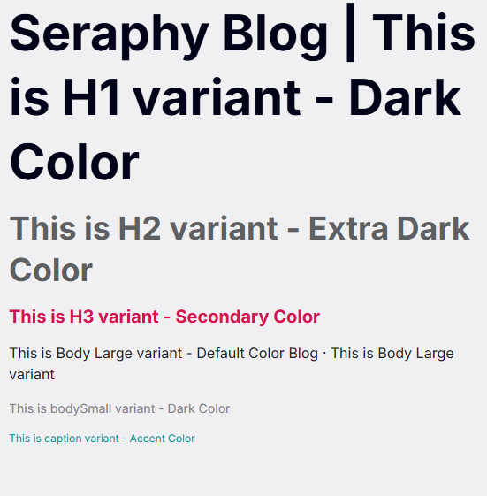
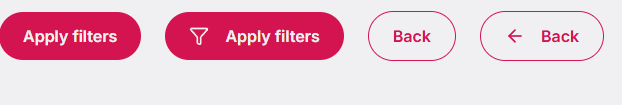
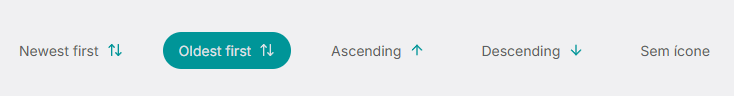
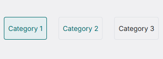
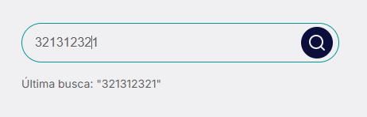

# Seraphy Blog

## Docker

To run the application with Docker:

```bash
docker compose up -d --build
```

The application will be available at: **http://localhost:5173**

## Design System

<figure>
  
  <figcaption>Typography variants</figcaption>
</figure>
<figure>
  
  <figcaption>Icons variants</figcaption>
</figure>
<figure>
  
  <figcaption>Buttons variants</figcaption>
</figure

<figure>
  
  <figcaption>Sort Item variants</figcaption>
</figure

<figure>
  
  <figcaption>Filter Item variants</figcaption>
</figure

<figure>
  
  <figcaption>Search Input Form</figcaption>
</figure
