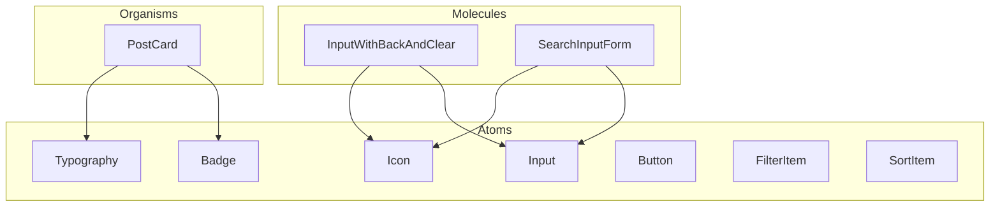

# Architecture (Modular)

Clean organization to demonstrate seniority in "Code Organization".

---

## Project Structure

```
src/
├── @types/         # Interface definitions (Post, Author, Category)
├── api/            # Data layer: isolated config, services with react-query
│   ├── axios.config.ts   # Isolated Axios instance (baseURL, timeout, headers)
│   ├── queryClient.ts    # React Query configuration
│   ├── constants/        # Query keys per domain (queryKeys.ts)
│   ├── types/            # API-specific types (post.types.ts, etc.)
│   └── services/         # Services with useQuery/useMutation (post.service.ts)
├── assets/         # Images, icons, and fonts
├── components/     # Reusable components (Atomic Design)
│   ├── atoms/      # Basic building blocks
│   ├── molecules/  # Combinations of atoms
│   ├── organisms/  # Complex UI sections
│   └── index.ts    # Barrel exports
├── context/        # Context API providers
├── hooks/          # Custom hooks that consume the services (usePosts, useAuthor)
├── pages/          # Main views (Home/Feed and PostDetail)
│   ├── Home/
│   │   └── index.tsx
│   └── PostDetails/
│       └── index.tsx
├── routes.tsx      # Register page routers
├── App.tsx
├── styles/         # styled-components base
│   ├── theme.ts          # Design tokens (colors, typography, spacing, breakpoints)
│   ├── themeColors.ts    # Color helper with autocomplete (themeColors, getThemeColor)
│   ├── mediaBreakPoints.ts  # Breakpoint values
│   ├── media.ts          # Mobile-first media queries
│   ├── global.ts         # GlobalStyle (reset, base typography)
│   └── index.ts         # Barrel exports
└── utils/          # Helper functions and formatters
```

---

## Components: Atomic Design

Components follow [Atomic Design](https://bradfrost.com/blog/post/atomic-web-design/) to improve discoverability and maintainability.

### Folder Structure

```
src/components/
├── atoms/           # Single-purpose, no internal component composition
│   ├── Badge.tsx
│   ├── Button.tsx
│   ├── FilterItem.tsx
│   ├── Icon.tsx
│   ├── Input.tsx
│   ├── SortItem.tsx
│   ├── Typography.tsx
│   └── index.ts
├── molecules/       # Combinations of atoms into functional units
│   ├── InputWithBackAndClear.tsx
│   ├── SearchInputForm.tsx
│   └── index.ts
├── organisms/       # Complex UI sections composed of atoms and molecules
│   ├── PostCard/
│   │   ├── index.tsx
│   │   ├── types.ts
│   │   └── styles.ts
│   └── index.ts
└── index.ts         # Main barrel (re-exports all layers)
```

### Layer Definitions

| Layer | Description | Examples |
|-------|-------------|----------|
| **Atoms** | Basic building blocks. Single-purpose, no internal component imports. | Typography, Input, Icon, Badge, Button, FilterItem, SortItem |
| **Molecules** | Groups of atoms that form a functional unit. | InputWithBackAndClear (Icon + Input), SearchInputForm (Icon + Input) |
| **Organisms** | Complex UI sections. Combine atoms and molecules. | PostCard (image, typography, badges, link) |

### Component Dependency Graph



### Import Conventions

- **Consumers (pages, etc.):** Import from the main barrel: `import { Button, PostCard } from '../../components'`
- **Cross-layer imports:** Molecules import atoms via `../atoms/Component`. Organisms import atoms via `../../atoms/Component`.
- **No circular dependencies:** Atoms never import from molecules or organisms. Molecules never import from organisms.

---

## API Layer Flow

1. **`axios.config.ts`** — Isolated Axios instance configuration (baseURL, timeout, headers). Services import this instance to make requests.

2. **`services/`** — Each service (e.g. `post.service.ts`) encapsulates API calls using **React Query** (`useQuery`, `useMutation`). Each folder/file is responsible for an application domain.

3. **`hooks/`** — Custom hooks consume the services. The hook exposes `data`, `isLoading`, `error` etc. to components, keeping data logic separate from UI.

4. **`constants/`** — Centralized query keys per domain for React Query cache and invalidation.

5. **`types/`** — API-specific types and interfaces, separate from global `@types`.
