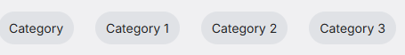
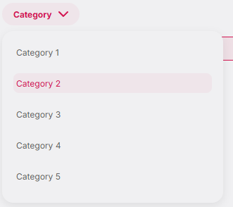
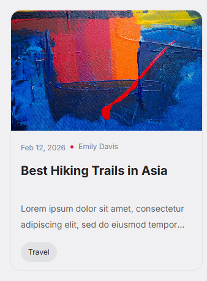

# Design System

<figure>
  
  <figcaption>Typography variants</figcaption>
</figure>

<figure>
  
  <figcaption>Icons variants</figcaption>
</figure>

<figure>
  
  <figcaption>Buttons variants</figcaption>
</figure>

<figure>
  
  <figcaption>Sort Item variants</figcaption>
</figure>

<figure>
  
  <figcaption>Filter Item variants</figcaption>
</figure>

<figure>
  
  <figcaption>Search Input Form</figcaption>
</figure>

<figure>
  
  <figcaption>Badge</figcaption>
</figure>

<figure>
  
  <figcaption>Drop Down</figcaption>
</figure>

<figure>
  
  <figcaption>Card</figcaption>
</figure>
